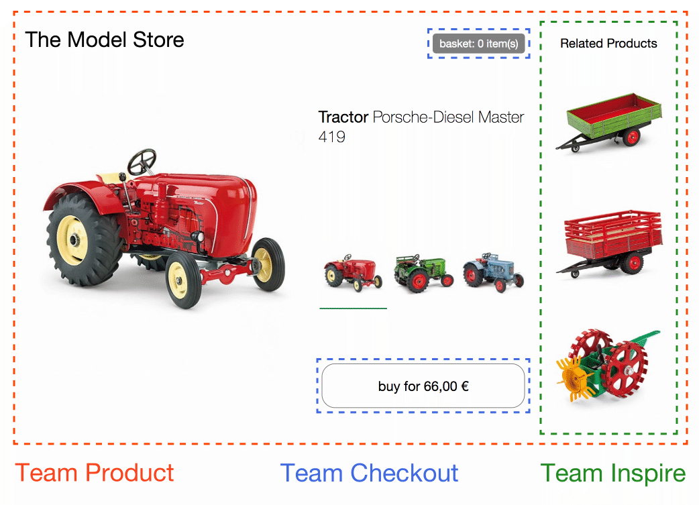
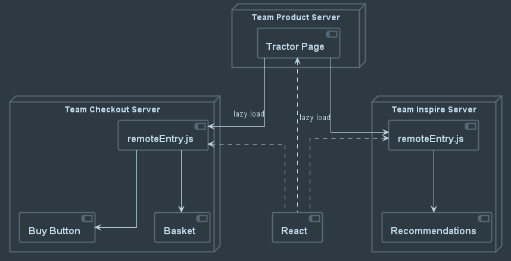

# Rapid Micro Frontend Development with Module Federation

- [Rapid Micro Frontend Development with Module Federation](#rapid-micro-frontend-development-with-module-federation)
  - [What are MFEs?](#what-are-mfes)
  - [What is Module Federation?](#what-is-module-federation)
  - [Using Module Federation to Build Micro Frontends](#using-module-federation-to-build-micro-frontends)
  - [How Should I Divide My Application?](#how-should-i-divide-my-application)
  - [Dev Tools Can Make it Easier](#dev-tools-can-make-it-easier)
  - [Recent Lessons Learned](#recent-lessons-learned)

## What are MFEs?
A high-level overview of Micro Frontends.  Reference the PoC website https://micro-frontends.org, talk about where they can be found in the wild and how they can be created / deployed.



## What is Module Federation?
- High-level intro to Webpack and it's plugin eco-system.
   
   JavaScript bundler used for packaging and/or transforming source assets into production code for client browsers.  Plugin architecture allows for extensibility to suit needs of developers and project.  Module Federation is a core (Webpack implemented) plugin.

   

- Mid-level discussion of Module Federation.

   Provides a containerization of modules for re-use and remote consumption.  Aloows loading separately compiled applications at runtime into the same execution context while sharing common dependencies.  Enables independent builds for disctinct functionalities that can be hosted separately and loaded into a common host application at _runtime_.

   *With the addition of state management framework(s), enables sharing common data among independent components as well.

   

## Using Module Federation to Build Micro Frontends
- Why MF over other MFE techniques?
   - Code-first approach
   - Runtime integration / loading.
   - Ehanced opportunities for customizing integration of independent applications (if necessary)
   - Independent builds and releases (when a single domain changes, no need to re-build the _entire_ system)
   
- How it's used to define a host and a _remote_.  Define terms.
   - host => "wrapper" application
   - remote => "served" MFE from `remoteEntry.js`

   [_Small_ example `code` snippets of a **host** and a 
   **remote** configuration.]
   ```
   plugin module sample for host
   ```
   ```
   plugin module sample for remote
   ```

## How Should I Divide My Application?
- Refactoring or From Scratch:
   - Domain Driven Design
   - Use existing team domains
   - Find simple, stable components and extract

## Dev Tools Can Make it Easier
- Discuss tools used on recent experience.  
   - Nx / Nx Console (VS Code)
   - NgRx (State Management)
   - Angular Architects Plugins (Module Federation Helpers)
- npm scripts for rapid app setup, etc.  (React, Vue, etc quick-start applications)
   - npx create-mf-app => FAST scaffolding for an independent MFE application


## Recent Lessons Learned
- Multiple repositories and how to wrangle Git Submodules
- Networking in multiple Azure "environments" and delivering modules through APIM
- Sharing state between modules
  - Authentication, etc.